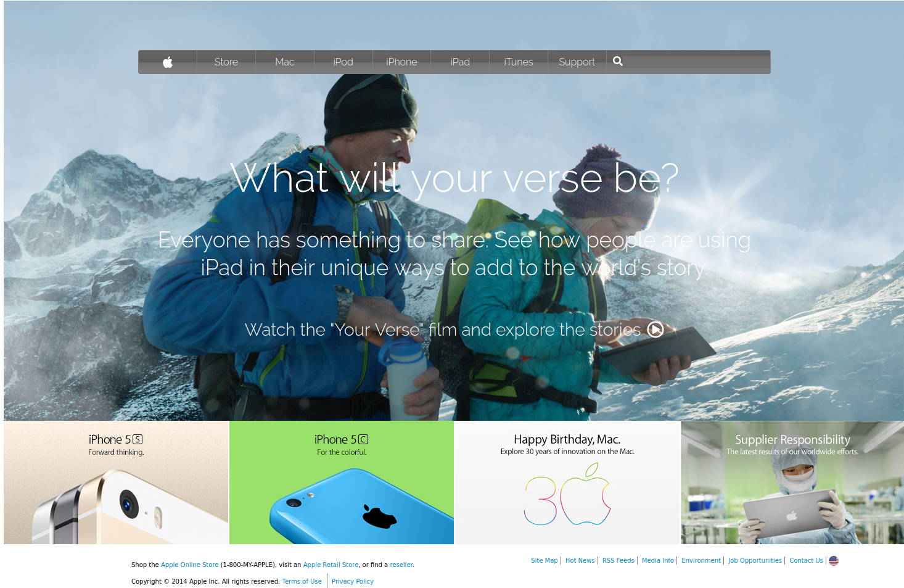

# Apple.com Webpage Clone

> This project was to clone the Apple.com webpage using backgrounds and gradient colors.

This project contains the following features:

1.  Navbar with gradient apple.com colors
2.  Grid and FlexBox layouts
3.  Background image

## Built With

- HTML5 and CSS
- Font Awesome Icons

## Live Demo

[Live Demo Link](https://rawcdn.githack.com/Azeem838/apple.com-webpage/d620185eedd8adce38bddd29b11662e6a8f9166d/index.html)

## Authors

👤 Azeem Ahmed

- Github: [@Azeem838](https://github.com/Azeem838)

## 🤝 Contributing

Contributions, issues and feature requests are welcome!

Feel free to check the [issues page](issues/).

## Show your support

Give a ⭐️ if you like this project!

## 📝 License

This project is [MIT](lic.url) licensed.
